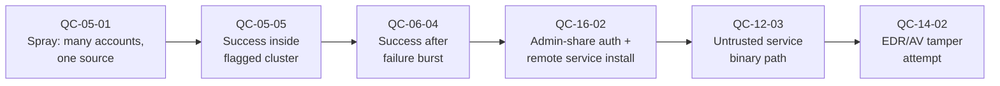
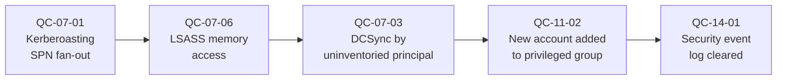
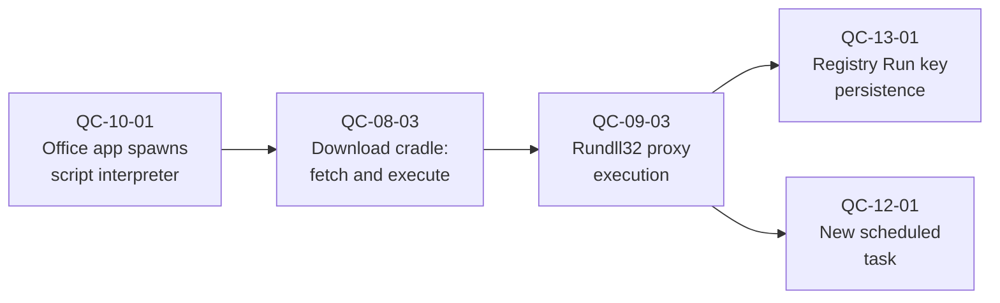
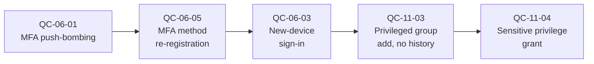
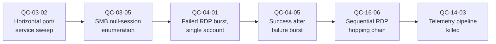

# Part 27 — Multi-Behavior Hunt Chains

## Why this part exists

**[CONCEPT]** Every pattern in Parts 3–26 proves one behavior in isolation — a spray cluster, a suspiciously named service, a cleared security log. A real intrusion is almost never one behavior. It is a small number of behaviors, drawn from different parts of this book, that land close together against the same account or host. This part exists to give a hunter deliberate practice at stringing single-pattern hits into that larger narrative on purpose, instead of noticing the connection by accident three tickets later. DEH Part 44 (Adversary Behaviour for Defenders) already frames attacker activity stage by stage — behavior, evidence, detection, hunting angle, visibility gap — across the kill chain from a pure detection perspective; this part is that framework applied concretely to this book's own pattern catalog, not a re-derivation of it. DEH Parts 34–36 (Threat Hunting Fundamentals, Hunt Types, Hunt to Detection) own hunting methodology generally — hypothesis formation, hunt types, the hunt-to-detection pipeline — and this part assumes that grounding rather than re-teaching it. A hunt chain below is simply several TTP-based hunts (DEH Part 35) run in a fixed pivot order against one identity or host, cited by pattern ID rather than re-explained from first principles.

This part's scope boundary is explicit and, per `STYLE-GUIDE.md` §11, structural rather than a matter of degree: Part 27 introduces **zero** new query patterns. Every step in every chain below cites an existing `QC-NN-SS` pattern ID already carrying its own header table, its own six-language (or fewer, with a named `N/A`) query implementations, and its own `[FALSE POSITIVE]`/`[PIVOT]` entries in its home part. A chain step reads "see `QC-05-01`," not a restated Sigma or KQL block — this book's Part 1 states the same rule ("a chain step cites `QC-05-02`, it does not restate it") and this part holds to it throughout. Three further boundaries, stated once so no chain below has to repeat them: this part does not score coverage, quality, or debt for the patterns it cites — that is Part 28's job, applied to the catalog as a whole, not to five worked narratives. This part does not own escalation procedure, case-handling, or playbook mechanics — each chain's closing hand-off note names the SOC Playbook Handbook path a corroborated chain would trigger, and stops there rather than restating triage steps that belong in that volume. This part does not teach query-language mechanics — DEH Parts 23–29 and DEH Appendix A5 already do that, and every language-specific claim a cited pattern makes still lives entirely in that pattern's own home part.

## The hunt-chain template

Each chain in this part carries a permanent ID in the form `HC-27-0N`, tracked in Appendix A1 alongside every `QC-NN-SS` pattern ID, using the same position-independent discipline: a chain's ID never moves to close a gap left by a removed one. A chain's header table opens the section, before any prose, with six fields:

| Field | Value |
|---|---|
| **Chain ID** | `HC-27-0N` |
| **Scenario** | One clause naming the end-to-end narrative. |
| **ATT&CK chain** | The ordered techniques the chain's steps map to, spelled out in full per DEH's guide §5's standalone-line rule. |
| **Pattern sequence** | The `QC-NN-SS` IDs in the order a hunter actually pivots through them. |
| **DEH cross-ref** | DEH Part 44; DEH Parts 34–36; any pattern-specific DEH citation already carried by a cited step's own header table is not repeated here. |
| **Hand-off** | The SOC Playbook Handbook escalation path this chain, once corroborated, triggers. |

After the header table: one **[HUNTER]** paragraph making the case for why the chain is worth hunting as a chain — what the combination shows that no single cited pattern's own `[HUNTER]` framing already covers — followed by a `CONCEPTUAL` flow diagram, a pivot table naming what each step establishes and why it justifies moving to the next, one **[FALSE POSITIVE]** entry describing the chain-level coincidental-narrative risk (a benign multi-step story that touches the same patterns without being one continuous attack — a different risk than any single step's own false-positive driver, already documented at that step's home pattern), and one **[PIVOT]** entry serving as the hand-off note. No chain repeats a cited pattern's own `[FALSE POSITIVE]` or `[PIVOT]` content; each chain's entries are additive, chain-level observations only.

> **Engineering Reality**
> Every chain below depends on binding hits across different telemetry sources to the same identity or host, and the sources rarely spell either the same way. A domain controller's Security log carries a bare `TargetUserName` (sAMAccountName); a cloud IdP sign-in log carries a UPN or email address for the same person; EDR telemetry keys off a SID or a machine GUID rather than a hostname string at all. A chain query that joins `TargetUserName = TargetUserName` across a domain controller and an Entra ID sign-in log will silently return zero rows even when the same person triggered both events, because the two fields were never the same string to begin with. Confirm your platform already maintains an identity-resolution table mapping SID, sAMAccountName, UPN, and email to one canonical identity — or build one — before trusting a chain's empty result as "nothing happened" rather than "the join key didn't match." This single problem is the most common reason a hunter abandons a genuinely correct chain hypothesis as unproductive.

**[SOC MANAGEMENT]** A full hunt chain is usually a worse candidate for one standing correlation rule than any single cited pattern is on its own, because the join spans telemetry sources that often live in different retention tiers, ingestion delays, or platforms entirely — the real-time cross-source query cost frequently exceeds the marginal detection value over running each component pattern as its own standing rule and reviewing overlap on a scheduled cadence. Treat a chain below as a hunt playbook a person runs weekly, or immediately after any one of its component patterns fires on its own, rather than a target for full correlation-rule graduation. Where a specific two- or three-step sub-sequence proves reliable enough to graduate — most often the last two steps, where confidence is already highest — graduate that sub-sequence alone; the graduation unit is a pattern pair or triple, not the whole narrative. Staffing and shift-coverage implications of running scheduled hunts at this cadence belong to the SOC Manager's Operating Handbook, not here.

## Hunt chains in this part

### HC-27-01 — Spray to domain foothold: external identity compromise into lateral movement and persistence

| Field | Value |
|---|---|
| **Chain ID** | `HC-27-01` |
| **Scenario** | A distributed password-spray campaign yields one working credential, which the attacker uses within hours to move laterally over SMB admin shares and install a persistent service. |
| **ATT&CK chain** | T1110.003 (Password Spraying) → T1078 (Valid Accounts) → T1078 (Valid Accounts) — independently corroborated via `QC-06-04`'s own failure-burst/success telemetry → T1021.002 (Remote Services: SMB/Windows Admin Shares) → T1543.003 (Create or Modify System Process: Windows Service) → T1562.001 (Impair Defenses: Disable or Modify Tools) |
| **Pattern sequence** | `QC-05-01` → `QC-05-05` → `QC-06-04` → `QC-16-02` → `QC-12-03` → `QC-14-02` |
| **DEH cross-ref** | DEH Part 44 §Credential Access/Lateral Movement stages; DEH Parts 34–36 |
| **Hand-off** | SOC Playbook Handbook — escalation path for a confirmed account compromise progressing to active lateral movement |

**[HUNTER]** Any one of these six patterns read alone is close to a coin flip between attacker and routine noise — Part 5 and Part 16 both name that exact ambiguity in their own `[FALSE POSITIVE]` entries for a scanner-driven spray cluster and a legitimate admin push, respectively. The hunt is in the join: a `QC-05-01` spray cluster whose flagged account list overlaps a `QC-16-02` admin-share logon on the same account inside a 24–48 hour window is a materially different claim than either hit read on its own. Start from whichever pattern fired first in your environment — usually the identity-side cluster — and walk forward through the sequence below, because no single one of the six home parts is positioned to build this specific cross-part join as a standing detection.

**Figure 27.1 — `HC-27-01` pattern-citation flow, spray to persistence.** *CONCEPTUAL.* Illustrates the pivot order a hunter follows through six already-published pattern IDs; it names no new query logic and is not a capture of any real incident. Diagram ID `FIG-27-01`.

| Step | Pattern | What it establishes | Why it justifies the next step |
|---|---|---|---|
| 1 | `QC-05-01` — single-source spray against many accounts | One source IP produced a bad-password failure against many distinct accounts. | Produces the candidate account list every later step keys on. |
| 2 | `QC-05-05` — successful authentication surfacing inside a flagged spray cluster | One of those accounts authenticated successfully. | Narrows the chain from "campaign" to one specific compromised identity. |
| 3 | `QC-06-04` — successful sign-in immediately following a failed-login burst | Corroborates step 2 from the authentication-anomaly side, derived independently of the spray-cluster join. | Two independently derived patterns agreeing on the same account and timestamp raises confidence well above either alone. |
| 4 | `QC-16-02` — admin-share authentication immediately followed by remote service installation | The compromised account authenticates to a second host over SMB and installs a service there within minutes. | Marks the transition from "credential compromised" to "credential actively being used to move." |
| 5 | `QC-12-03` — Windows service created via the Service Control Manager pointing outside a trusted binary path | Names the specific service and binary path installed in step 4. | Gives an artifact — service name, binary, hash — to pivot into EDR and threat-intel lookups. |
| 6 | `QC-14-02` — EDR/AV agent service stop, process kill, or uninstall attempt | The attacker tries to blind the tooling that would catch step 5's payload running. | The clearest tell that steps 1–5 are attacker-driven — a legitimate service install does not fight its own EDR agent immediately afterward. |

**[FALSE POSITIVE]** A help-desk-driven mass password reset (which produces `QC-05-01`-shaped failure clusters as users retype old passwords) followed, in the same week, by IT's own legitimate admin-share software push (`QC-16-02`) and a scheduled EDR agent upgrade that briefly stops the old agent service (`QC-14-02`) can walk this entire chain end to end with no attacker present. The discriminator is the account, not the timing: a real attack chain rides one specific compromised account through every step, while the benign version has each step performed by a different account — helpdesk resetting others, an IT admin account running the push, a deployment account touching the EDR service — even though the events cluster in the same week. Confirm identical `TargetUserName`/`principal.user` values across steps 2, 4, and 6 before treating the chain as real.

**[PIVOT]** Once steps 4–6 corroborate the same account and a service artifact is in hand, this chain hands off to the SOC Playbook Handbook's escalation path for a confirmed account compromise progressing to active lateral movement; containment, credential reset, and host-isolation procedure live there, not here.

> **Blind Spot**
> This chain only resolves if the attacker's post-compromise movement happens to be SMB-admin-share-based. An attacker who instead pivots via a stolen browser session token, a cloud API key, or a legitimate remote-access tool already permitted in the environment produces no `QC-16-02` hit at all, and the chain silently stalls at step 3 with no signal that anything happened afterward — the account looks compromised and then looks quiet, which is easy to misread as "contained" rather than "moved somewhere this chain doesn't watch."

### HC-27-02 — Kerberos ticket abuse to domain-controller-level compromise

| Field | Value |
|---|---|
| **Chain ID** | `HC-27-02` |
| **Scenario** | An attacker harvests service-account credential material via Kerberoasting and LSASS memory access, uses one credential to run DCSync against a domain controller, then mints a new account with domain admin rights for standing access. |
| **ATT&CK chain** | T1558.003 (Kerberoasting) → T1003.001 (OS Credential Dumping: LSASS Memory) → T1003.006 (OS Credential Dumping: DCSync) → T1136.002 (Create Account: Domain Account) / T1098 (Account Manipulation) → T1070.001 (Indicator Removal: Clear Windows Event Logs) |
| **Pattern sequence** | `QC-07-01` → `QC-07-06` → `QC-07-03` → `QC-11-02` → `QC-14-01` |
| **DEH cross-ref** | DEH Part 44 §Credential Access stage; DEH Part 13 (Identity: Directory, Privilege & Kerberos Detection), already cited in full by this book's Part 7 |
| **Hand-off** | SOC Playbook Handbook — tier-0 identity / domain-controller compromise path |

**[HUNTER]** Kerberoasting alone is common in benign form — Part 7 names vulnerability scanners and SPN-enumeration tooling as routine producers of the identical request fan-out. What separates a genuine domain-compromise chain from scanner noise is whether a `QC-07-01` hit is followed, on the same host or by the same downstream account, by LSASS access and then DCSync — three independently low-confidence signals from three different telemetry sources (4769 ticket-request metadata, process/handle access to `lsass.exe`, and directory-replication metadata) converging on one account is a materially stronger claim than any one of them alone. This chain also illustrates why Part 7 draws its scope boundary against Part 17: every step below is theft-side; what the attacker does with a *different* stolen ticket on a *different* host is this book's Part 17 territory or `HC-27-01`'s own shape, not repeated here.

**Figure 27.2 — `HC-27-02` pattern-citation flow, Kerberos abuse to domain compromise.** *CONCEPTUAL.* Illustrates the pivot order across five already-published pattern IDs spanning three independent telemetry sources; it is not a capture of any real incident. Diagram ID `FIG-27-02`.

| Step | Pattern | What it establishes | Why it justifies the next step |
|---|---|---|---|
| 1 | `QC-07-01` — Kerberoasting via SPN request fan-out | A burst of TGS requests for high-value SPNs from one source. | Gives a candidate source host and account for offline hash cracking. |
| 2 | `QC-07-06` — LSASS memory access enabling hash and ticket harvesting | The same or a related account on the source host directly touches `lsass.exe`. | Shows the attacker is also harvesting in-memory material, not only cracking offline — a materially heavier signal. |
| 3 | `QC-07-03` — DCSync by a non-inventoried principal | A principal absent from the maintained replication-rights inventory issues a directory-replication request. | Confirms a harvested credential had, or was granted, replication rights — the step that turns theft into domain-level compromise. |
| 4 | `QC-11-02` — account created and immediately added to a privileged group | The attacker mints their own tier-0 account rather than continuing to ride the stolen one. | The persistence move: standing access that survives the stolen account's password rotation. |
| 5 | `QC-14-01` — security event log cleared | The audit trail for step 4's 4720/4728 events is removed. | Closes the loop on the specific evidence that would otherwise expose step 4. |

**[FALSE POSITIVE]** A legitimate, authorized security assessment against the same domain controller can produce an identical shape: Kerberoasting via an approved tool, an EDR agent's own legitimate LSASS access (many EDR products touch `lsass.exe` for credential-theft detection itself), and a DCSync from a newly onboarded backup or identity-governance service account not yet added to the replication-rights inventory. Cross-check step 3 against change-management records for recently provisioned service accounts before treating an "uninventoried" DCSync source as hostile — a stale inventory, not a hostile DCSync, is this chain's single most common false escalation.

**[PIVOT]** A hit through step 3 alone, even without steps 4–5, is already tier-0 severity and hands off immediately to the SOC Playbook Handbook's domain-controller-compromise path; do not wait for account-creation confirmation before escalating.

> **What Would Change My Mind**
> This chain treats independent-source convergence — ticket-request telemetry, process-access telemetry, and directory-replication telemetry all naming the same account — as strong evidence specifically because those three sources are unlikely to be triggered together by one benign actor. If a single authorized tool (a purple-team framework, or a credential-hygiene scanner) is common enough in your environment to legitimately produce all three telemetry events in one run, that assumption weakens, and this chain's confidence should drop from High to Medium until step 3's inventory check clears it.

### HC-27-03 — Malicious document to living-off-the-land execution to dual persistence

| Field | Value |
|---|---|
| **Chain ID** | `HC-27-03` |
| **Scenario** | A phishing-delivered Office macro spawns a PowerShell download cradle, hands execution to a LOLBin to fetch and run a second-stage payload, and the payload installs both a registry Run key and a scheduled task for redundant persistence. |
| **ATT&CK chain** | T1204.002 (User Execution: Malicious File) → T1059.001 (Command and Scripting Interpreter: PowerShell) → T1218.011 (System Binary Proxy Execution: Rundll32) → T1547.001 (Boot or Logon Autostart Execution: Registry Run Keys / Startup Folder) → T1053.005 (Scheduled Task/Job: Scheduled Task) |
| **Pattern sequence** | `QC-10-01` → `QC-08-03` → `QC-09-03` → `QC-13-01` → `QC-12-01` |
| **DEH cross-ref** | DEH Part 44 §Initial Access/Execution/Persistence stages; DEH Part 10 (PowerShell), DEH Part 11 (Endpoint), already cited by this book's Parts 8, 9, 10, 12, 13 |
| **Hand-off** | SOC Playbook Handbook — malicious-document execution / commodity-malware containment path |

**[HUNTER]** Each of these five patterns, read alone, is exactly the kind of hit a triage queue drowns in — Parts 8, 9, and 10 each name a high-volume legitimate driver (admin scripting, installers calling `rundll32`, IT-deployed macro templates). What makes this worth hunting as a chain rather than five separate low-priority tickets is process-tree lineage: an Office process spawning a script host, that script host's own child fetching and executing via a LOLBin, and that LOLBin's resulting process writing to both a Run key and a new scheduled task within the same short window on the same host, is one unbroken lineage — not five coincidences that happen to share a hostname.

**Figure 27.3 — `HC-27-03` pattern-citation flow, macro to dual persistence.** *CONCEPTUAL.* Illustrates the pivot order across five already-published pattern IDs, branching at the persistence stage into two parallel mechanisms; it is not a capture of any real incident. Diagram ID `FIG-27-03`.

| Step | Pattern | What it establishes | Why it justifies the next step |
|---|---|---|---|
| 1 | `QC-10-01` — Office application spawning a command or script interpreter as a direct child | Establishes the entry vector and the parent process every later lineage check anchors to. | Gives the process-tree root the rest of the chain must descend from. |
| 2 | `QC-08-03` — download cradle: fetch and execute in one line | The spawned interpreter immediately reaches out and executes fetched content rather than running a static local script. | The strongest single tell that this is not a legitimate macro-driven business workflow. |
| 3 | `QC-09-03` — Rundll32 proxy-executing a non-standard or remote DLL | The fetched payload hands execution to a LOLBin rather than running as its own signed binary. | The defense-evasion step, and the point where a signature-based control is most likely to be blind. |
| 4 | `QC-13-01` — Registry Run/RunOnce key autostart persistence | The payload writes its first persistence mechanism. | Gives a concrete autostart artifact to remove during remediation. |
| 5 | `QC-12-01` — new scheduled task created with a suspicious action | A second, redundant persistence mechanism appears within the same session, from the same lineage. | Redundant persistence from one process lineage is a stronger signal than either mechanism alone — a legitimate installer only rarely writes both at once. |

**[FALSE POSITIVE]** An in-house software-deployment tool distributed via a signed, macro-enabled template — one that downloads an installer through PowerShell, calls `rundll32` as part of a normal install routine, and registers both a Run key and a scheduled task as its own supported update mechanism — reproduces this exact five-step shape. The discriminator is code-signing and destination reputation on step 2's download and step 3's DLL: a fetch from an internal, signed artifact repository is a different claim than a fetch from a raw IP or a newly registered domain. Check certificate and signature status on the step-3 DLL and destination reputation on the step-2 URL before treating the full chain as malicious.

**[PIVOT]** Hands off to the SOC Playbook Handbook's malicious-document-execution containment path once steps 2 and 3 both resolve to unsigned or unreputable artifacts; where either resolves clean, treat the hit as a software-deployment false positive per the entry above rather than escalating.

> **Engineering Reality**
> This entire chain depends on process-tree telemetry — Sysmon Event ID 1 (Process Create) or an EDR platform's own lineage view — to link steps 1 through 3 into one causal sequence rather than three coincidentally-timed events on the same host. Without parent/child process data, this chain degrades to three independent low-confidence hits that a hunter has to manually correlate by timestamp and host, which is slower and far more error-prone than the lineage join this chain assumes throughout. Confirm process-tree logging is actually enabled and flowing before running this chain, rather than trusting an absence of hits as a clean host.

### HC-27-04 — MFA fatigue to account manipulation to privilege escalation

| Field | Value |
|---|---|
| **Chain ID** | `HC-27-04` |
| **Scenario** | An attacker exhausts a user with MFA push notifications until one is approved, re-registers a new MFA method on the account, signs in from a device the account has never used, then manipulates group membership and grants a sensitive privilege. |
| **ATT&CK chain** | T1621 (Multi-Factor Authentication Request Generation) → T1556.006 (Modify Authentication Process: Multi-Factor Authentication) / T1098.005 (Account Manipulation: Device Registration) → T1078.004 (Valid Accounts: Cloud Accounts) → T1098 (Account Manipulation) → no clean single-technique mapping for the final step, per `QC-11-04`'s own header table |
| **Pattern sequence** | `QC-06-01` → `QC-06-05` → `QC-06-03` → `QC-11-03` → `QC-11-04` |
| **DEH cross-ref** | DEH Part 44 §Credential Access/Privilege Escalation stages; DEH Part 12, DEH Part 13, already cited by this book's Parts 6 and 11 |
| **Hand-off** | SOC Playbook Handbook — account-takeover-to-privilege-escalation escalation path |

**[HUNTER]** Part 6 already names push-bombing's core ambiguity: a single approved push after a burst of denials is close to a coin flip between "the attacker got in" and "a tired user tapped approve without reading it," and Part 6's own pattern cannot resolve that ambiguity alone. It resolves once the same account's MFA method changes and a sign-in from a device never seen for that account follows shortly after, and it resolves completely once that account starts touching group membership or rights it has no history of touching. This chain is the worked answer to the question Part 6's own `[HUNTER]` framing raises without fully answering, because the answer needs patterns from two different parts read together.

**Figure 27.4 — `HC-27-04` pattern-citation flow, MFA fatigue to privilege escalation.** *CONCEPTUAL.* Illustrates the pivot order across five already-published pattern IDs spanning two identity-side parts; it is not a capture of any real incident. Diagram ID `FIG-27-04`.

| Step | Pattern | What it establishes | Why it justifies the next step |
|---|---|---|---|
| 1 | `QC-06-01` — MFA push-notification fatigue (push bombing) | A burst of MFA prompts against one account, ending in one approval. | Marks the moment the attacker plausibly gained the second factor. |
| 2 | `QC-06-05` — MFA method re-registration immediately preceding a sign-in from an unfamiliar device | The same account re-registers its second factor shortly after step 1's approval. | Shows the attacker locking in their own persistent access method to the second factor, not just riding a one-time approval. |
| 3 | `QC-06-03` — new-device or new-country sign-in against an established baseline | Confirms the sign-in enabled by steps 1–2 came from infrastructure genuinely new to this account's baseline. | Rules out a simple personal-device swap as the explanation. |
| 4 | `QC-11-03` — existing account added to a privileged group with no matching history | The compromised account, or one it controls, gains standing privilege it has never held. | The first concrete escalation action, and the point where impact becomes assessable. |
| 5 | `QC-11-04` — sensitive privilege or token right granted outside normal administrative activity | A quieter, rights-assignment-level escalation that a group-membership-only hunt would miss entirely. | Catches an attacker who skips step 4's comparatively well-monitored group-membership route and goes straight for a token right instead. |

**[FALSE POSITIVE]** An employee who genuinely loses a phone reproduces steps 1–3 almost exactly: repeated pushes while trying old devices, a legitimate help-desk-assisted MFA re-registration, and a first-time sign-in from a replacement device, all in one day, with no attacker involved. A lost-phone story essentially never also produces steps 4–5 — a brand-new device and a freshly re-registered MFA method touching group membership or a sensitive privilege in the same session. Treat steps 1–3 alone as an identity-support ticket to verify, not an incident, and reserve escalation for a chain that reaches step 4 or 5.

**[PIVOT]** Hands off to the SOC Playbook Handbook's account-takeover escalation path once step 4 or 5 fires; where the chain stops at step 3, route to identity/help-desk verification instead of security escalation.

### HC-27-05 — Recon to brute-forced remote access to multi-hop lateral movement and anti-forensics

| Field | Value |
|---|---|
| **Chain ID** | `HC-27-05` |
| **Scenario** | An internal scanning sweep finds an exposed RDP service and an accessible share, brute force against a discovered account succeeds, the attacker hops across multiple internal hosts by RDP, and then kills the endpoint telemetry pipeline. |
| **ATT&CK chain** | T1595.001 (Active Scanning: Scanning IP Blocks) / T1046 (Network Service Discovery) → T1135 (Network Share Discovery) → T1110.001 (Password Guessing) → T1078 (Valid Accounts) — the confirmed-working credential surfaced by `QC-04-05` → T1021.001 (Remote Services: Remote Desktop Protocol) → T1562.001 (Impair Defenses: Disable or Modify Tools) |
| **Pattern sequence** | `QC-03-02` → `QC-03-05` → `QC-04-01` → `QC-04-05` → `QC-16-06` → `QC-14-03` |
| **DEH cross-ref** | DEH Part 44 §Reconnaissance/Credential Access/Lateral Movement stages; DEH Part 14 §1–§2 (Network Detection Engineering), already cited by this book's Parts 3, 4, and 16 |
| **Hand-off** | SOC Playbook Handbook — active lateral movement, contain-and-isolate path |

**[HUNTER]** Part 3 already frames its own scanning patterns as a scoping aid to run down after some other indicator, not standalone proof of compromise, and Part 4's brute-force patterns make the same admission about a raw failure burst. Chained together with a confirmed success and a multi-hop RDP pattern Part 16 names specifically because it is rarer in legitimate admin behavior than a single hop, the combination narrows a large, low-confidence recon signal down to one specific account and one specific lateral path — worth containing actively before the attacker's final step, killing telemetry, removes the SOC's visibility into what happens next.

**Figure 27.5 — `HC-27-05` pattern-citation flow, recon to multi-hop lateral movement.** *CONCEPTUAL.* Illustrates the pivot order across six already-published pattern IDs spanning network, identity, and endpoint telemetry; it is not a capture of any real incident. Diagram ID `FIG-27-05`.

| Step | Pattern | What it establishes | Why it justifies the next step |
|---|---|---|---|
| 1 | `QC-03-02` — horizontal port/service sweep across many hosts | Surfaces which internal hosts expose RDP (port 3389) and other services at all. | Produces the target-host list the rest of the chain narrows against. |
| 2 | `QC-03-05` — SMB null-session / anonymous share enumeration | A related source separately confirms share-level access on a subset of those hosts. | Corroborates step 1's target list from a second, independent telemetry source. |
| 3 | `QC-04-01` — high-volume failed RDP authentication against a single account | The attacker commits to brute-forcing one specific account on one specific host drawn from step 1's list. | Marks the transition from passive recon to an active credential-access attempt. |
| 4 | `QC-04-05` — successful authentication immediately following a single-account failure burst | The brute force succeeds. | Confirms working credentials against the targeted host. |
| 5 | `QC-16-06` — sequential RDP hopping chain via the same account | The now-compromised account is used to hop RDP across more than two hosts in sequence. | Part 16 flags this specific shape as materially rarer in legitimate admin behavior than a single scheduled-maintenance hop. |
| 6 | `QC-14-03` — telemetry pipeline killed outright, with no corresponding log-clear event | The attacker moves to blind the SOC's own visibility rather than merely covering tracks in the log itself. | This chain's load-bearing discriminator — see the false-positive entry below. |

**[FALSE POSITIVE]** An internal vulnerability-management scan (steps 1–2), coincidentally followed in the same week by a genuinely forgotten-password lockout-and-retry from a legitimate user (steps 3–4) and a help-desk technician's own multi-host RDP sweep during a patch cycle (step 5), can walk five of six steps with no attacker present. A legitimate patch cycle essentially never also kills the endpoint agent's own telemetry service (step 6) on every host it touches. Treat step 6 as this chain's load-bearing discriminator: without it, verify steps 3–5 against a current change-management or patch-cycle calendar before escalating; with it, escalate regardless of how weak steps 1–5 look individually.

**[PIVOT]** Hands off to the SOC Playbook Handbook's active-lateral-movement contain-and-isolate path immediately on any step-6 hit — losing telemetry visibility mid-intrusion is itself the containment trigger, independent of how well corroborated the earlier steps are.

## Cross-references

DEH Part 44 (Adversary Behaviour for Defenders — the stage-by-stage behavior/evidence/detection/hunting-angle framework this part's chains apply concretely); DEH Parts 34–36 (Threat Hunting Fundamentals, Hunt Types, Hunt to Detection — the hunting methodology this part assumes rather than re-teaches); DEH Part 13 (Identity: Directory, Privilege & Kerberos Detection, for `HC-27-02`'s Kerberos/DCSync telemetry); DEH Part 14 §1–§2 (Network Detection Engineering, for `HC-27-05`'s scanning and RDP-hop telemetry); DEH Part 43 (Detection Debt — the compute/complexity framing behind this part's `[SOC MANAGEMENT]` graduation guidance); DEH Appendix A5 (query-language mechanics for every cited pattern's own implementations, none restated here). Within this book: Part 1 (the six content tags and the exemption this part operates under, stated there first); Part 3 (Scanning & Enumeration, cited by `HC-27-05`); Part 4 (Brute Force, cited by `HC-27-05`); Part 5 (Password Spraying, cited by `HC-27-01`); Part 6 (MFA Abuse & Authentication Anomalies, cited by `HC-27-01` and `HC-27-04`); Part 7 (Kerberos & Directory Credential Attacks, cited by `HC-27-02`); Part 8 (Suspicious PowerShell Execution, cited by `HC-27-03`); Part 9 (LOLBins & Living-off-the-Land Execution, cited by `HC-27-03`); Part 10 (Suspicious Scripting Hosts & Macro Execution, cited by `HC-27-03`); Part 11 (Account Creation & Privilege Escalation, cited by `HC-27-02` and `HC-27-04`); Part 12 (Scheduled Tasks & Service Manipulation, cited by `HC-27-01` and `HC-27-03`); Part 13 (Registry, Startup & Alternate Persistence, cited by `HC-27-03`); Part 14 (Log Tampering & Security Tool Interference, cited by `HC-27-01`, `HC-27-02`, and `HC-27-05`); Part 16 (Lateral Movement via Admin Tools & Remote Services, cited by `HC-27-01` and `HC-27-05`); Part 17 (Lateral Movement via Stolen Tokens & Ticket Reuse — the theft-vs-use boundary `HC-27-02` names against this part); Part 28 (Maintaining the Cookbook — coverage/quality/debt scoring for the pattern catalog, not applied here); the SOC Playbook Handbook (every chain's hand-off note); the SOC Manager's Operating Handbook (staffing and cadence implications of running these chains as scheduled hunts, per this part's `[SOC MANAGEMENT]` entry); Appendix A1 (Master Pattern Index, tracking every `HC-27-0N` chain ID alongside every `QC-NN-SS` pattern ID); Appendix A4 (the blank hunt-chain template this part's header-table shape and tag usage instantiate).
